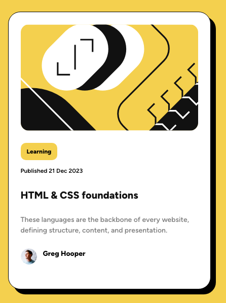

# Frontend Mentor - Blog preview card solution

This is a solution to the [Blog preview card challenge on Frontend Mentor](https://www.frontendmentor.io/challenges/blog-preview-card-ckPaj01IcS). Frontend Mentor challenges help you improve your coding skills by building realistic projects.

## Table of contents

- [Overview](#overview)
  - [The challenge](#the-challenge)
  - [Screenshot](#screenshot)
  - [Links](#links)
- [My process](#my-process)
  - [Built with](#built-with)
  - [What I learned](#what-i-learned)
  - [Continued development](#continued-development)
  - [Useful resources](#useful-resources)
- [Author](#author)
- [Acknowledgments](#acknowledgments)

## Overview

### Screenshot



### Links

- [Check out the code here](https://github.com/John-Davidson-8/fem-blog-preview-card-main)
- [Check out the site here](https://fem-blog-preview-card-main.netlify.app/)

## My process

With this project there was not much of a dimensional difference between the mobile and desktop version. Started mobile first then expanded the width slightly for desktop

### Built with

- Semantic HTML5 markup
- CSS custom properties
- Flexbox

### What I learned

I enjoyed this project as it was less complex than the previous few projects I have built. It is good at times to go back to smaller simpler projects to remind me of the basics of CSS and HTML

Below is css code snippet on how to center the element using CSS Flexbox and targeting the body element.

```css
body {
  background: var(--clr-primary-1-yellow);
  font-size: 1rem;
  min-height: 100vh;
  display: flex; /* it works with grid too  */
  justify-content: center;
  align-items: center;
}
```

### Continued development

As I learn Javascript I have realized that I have to continue to build html and css projects at the same time, as I do not want to forget what I have learned over the last 18 months.

## Acknowledgments

Once again I thank the Frontend Mentor community for all their help.
